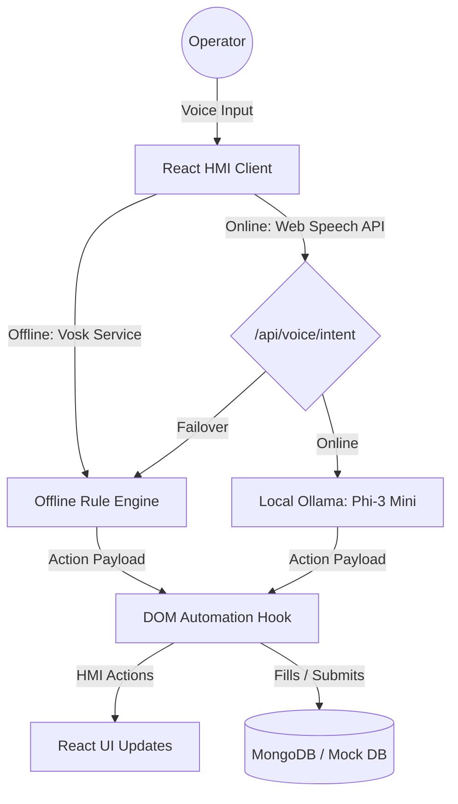

# VoiceEdge AI 🎙️🔩

### Edge-Powered Intelligent Voice Navigation & Automation Platform for Industrial HMI Systems

VoiceEdge AI is an industrial-grade, hands-free Human-Machine Interface (HMI) console. It empowers factory operators to interact with plant telemetry, safety documentation, and maintenance systems completely by voice—resolving the physical constraints of sterile or hazard-prone shop floors.

Using a hybrid architecture that balances **local offline Web Speech APIs, local Vosk Audio Analysers, and local Ollama Phi-3 Mini models**, the platform operates continuously, automatically switching between cloud-based NLP pipelines and fallback offline rule engines depending on network availability.

---

## 🚀 Key Features

* **Continuous Local Speech Engine**: Live transcription, visual soundwave frequency bouncing, and real-time confidence scores.
* **Smart Failover (Offline-First)**: Automatically hijacks and shifts inputs to a local Vosk analyzer model upon network dropouts.
* **Agentic DOM Automation**: Resolves natural language commands to automatically click buttons, navigate layouts, scroll screens, and search logs.
* **Futuristic AI Co-Pilot**: Executes compound multi-step agent actions:
  *"Machine 12 has abnormal vibration. Open its maintenance history, show the last inspection report, and create a maintenance ticket."*
  * Renders database retrieval overlays.
  * Auto-drafts forms, bypassing React state tracking descriptors.
  * Prompts for operator confirmation before writing changes to the database.
* **Voice Feedback**: Browser Speech Synthesis readbacks for hands-free confirmation of all operations.

---

## 🛠️ Tech Stack & Architecture



* **Frontend**: React (Vite), Vanilla CSS theme variables (steel gray `#2D2E30`, graphite background `#121315`, and safety amber accents `#FFB300`).
* **Backend**: Node.js, Express, MongoDB (with failover to fully functional In-Memory Mock Database for offline demo runs).
* **NLP**: Local Ollama pipeline + regex keyword parsing.

---

## 📦 Installation & Setup

### 1. Prerequisite Checklist
* **Node.js** (v18+)
* **Ollama** (Optional, to use online LLM mode. Install Ollama and pull model: `ollama pull phi3:mini`)

### 2. Configure Backend Server
1. Navigate to `/server`:
   ```bash
   cd server
   npm install
   ```
2. Launch the server:
   ```bash
   node server.js
   ```
   *Note: If MongoDB is not active on your system, the server automatically boots an in-memory database mock list for seamless demo sessions.*

### 3. Configure Frontend Client
1. Navigate to `/client`:
   ```bash
   cd ../client
   npm install
   ```
2. Start the Vite dev server:
   ```bash
   npm run dev
   ```
3. Open `http://localhost:5173` in your web browser.

---

## 🎙️ Hackathon Demo Script (Co-Pilot Showroom)

To demonstrate the full potential of **VoiceEdge AI** to the judges, follow this demo script:

1. **Activate Voice Engine**: Click the **Start Listening** button on the bottom status bar.
2. **Offline Mode Failover Test**: Pull your Ethernet cable or disable your Wi-Fi. Notice the UI instantly mounts a pulsing amber banner: **"VOICE ENGINE SWITCHED TO OFFLINE VOSK INTERFACES"**.
3. **Continuous Navigation**: Speak *"Open maintenance"* or *"Go to safety SOPs"*. The client routes instantly.
4. **Trigger AI Co-Pilot**: Speak clearly:
   > *"Machine 12 has abnormal vibration. Open its maintenance history, show the last inspection report, and create a maintenance ticket."*
5. **Observe Agent Execution**:
   * The HMI navigates to the **Machinery Telemetry Grid**, inputs the search query, and filters cards.
   * A flashing popup panel displays the retrieved inspector logs (*" bearing oscillation threshold exceeded by 18%"*).
   * The HMI routes to the **Maintenance Console**, autofills the Work Order ticket fields, and triggers a pulsing co-pilot prompt.
6. **Voice Confirm**: Speak *"Confirm"* or click the button. The ticket is immediately written to the log table.

---

## 📝 File Constraints
To keep the project clean, beginner-friendly, and maintainable, all files conform to a strict limit of **maximum 150 lines per file**. State coordination is separated into modular hooks and utility controllers.
